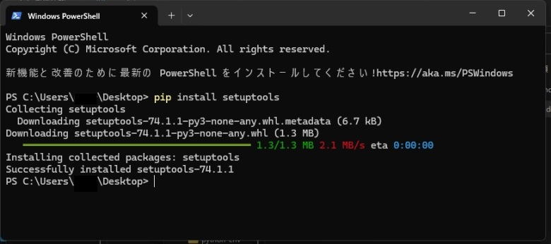

# PythonでAIと連携した多方面な開発をする方法
  
Python（パイソン）とは動的型付けのインタープリター言語という、数字や文字などの型を自動車でいえばオートマチック車のように自動で決めてもらえる、実行速度が早いコンパイル言語（インタープリターが対義語）と違い、初級者向けなプログラミング言語です。また動的型付けですので手動な静的型付けのコンパイル言語と違い、手数が少なくて済みそうなので、大規模システムが作りやすいかもしれません。  

AIと言ったらPythonのみな状況であり、最近は高校などで学習されているようです。実際に仕事で求められるPythonのスキルは、大卒の理数系の専門家のAIを作れる人な気がします。求人内容もJavaやPHPなどが多いのに対し需要は多いですが、この専門性の高さから求人数はそれほど多く無いようです。しかしAI時代ですので、これから増えると思います。

## インストールは難しくなく低コスト
世の中には有料のPythonの本が多くありますが、まずは無料情報なPythonの公式サイトやGithubなどでマニュアルやコードを参照したり、ダウンロードしてください。しかし英文ですので難しく思えますが、ブラウザを右クリックすれば日本語に翻訳もできますし、Downloadというページからインストーラーを探して、押していくだけです。

しかしPythonといっても、古いバージョンの総合開発環境のanacondaとOSに付属されている単体のpython.exeなどと、最新バージョンの単体のpython.exeなどがありますが、全てをインストールするのがお勧めです。なぜなら古い業務スクリプトも参照し、生成AIで新しいコードに変換してもらい、大量のコードを作成するという方法があるからです。  

なおインストールができなくても、今の時代にはクラウドで提供しているサーバーもありますが、無料レンタルなどは機能限定や保管や商品開発の秘密性などからして、自分のPCのhttp://localhost （ローカルホスト）などで開発の方が良いです。開発に必要なスペックは1万円ほどの中古のWindows10ぐらいのノートPCで十分です。

### anacondaをインストールするとAIと連携したシステムが作れる
anaconda（アナコンダ）とはPythonで高度な開発をするツールですが、anaconda（アナコンダ）とはPythonで高度な開発をするツールですが、容量が約４GBほど必要に対し、以下のPython.exeという単体なら、数十MBやanacondaだとPython.exeの最新バージョンを使用できない可能性があるので、下記のように単体でもインストールするのがお勧めです。  

また簡略化されたコマンドを入力できるパスはanacondaでは設定せずに、下記のPython.exeの最新バージョンでは設定するのがお勧めです。anacondaではJupyter Notebookなどを使うのを主とし、Python.exeの最新バージョンでは最新トレンドの把握などと考えています。

### Python.exeの最新バージョンをインストールしてトレンドを把握する
Python.exeをインストールする時に、Pytthonがインストールされたか確認できるバージョン表示のコマンド「python –version」などが表示できるパスを、自分で設定するのは慣れていても面倒なので、Python.exeをインストールする時にパスの同時インストールがお勧めです。パスが設定されていないや、インストールされていない状態ですと、ターミナルでは「Python」と表示されるだけなようです。

## pipインストールをしないと作成したいスクリプトは動かない
Python.exeをインストール直後だとsetuptoolsなどがインストールされていない状態なので、以下のようにインストールしましょう。
```
pip install setuptools
```
上記のコマンドをWindowsPowerShellなどで入力すると、下記のようになればインストールは成功です。  
  

### 起動には開発・デプロイ・クライアントOSが違うので書類の変更が必要
Windowsのターミナルでは初期設定で書類読み込みは、uft-8（ユニコード）ではなくANSI（ShiftJIS）になっているのに対し、デプロイ（設置）するgithubではuft-8のの改行コードがLF（UnixやMac）になっているので、クライアントPC（閲覧者のPC）にダウンロードしWindowsで起動する場合は、ダブルクリックで起動する書類だけは、ANSIのCR+LF（Windowsの改行コード）でメモ帳などで保存（変更）してください。  

あるいはWindowsのターミナルでuft-8で読み込む方法もありますが、少し複雑なのと、昔からの業務スクリプトなどがANSIが多い点からして、上記の書類を変更が無難です。
